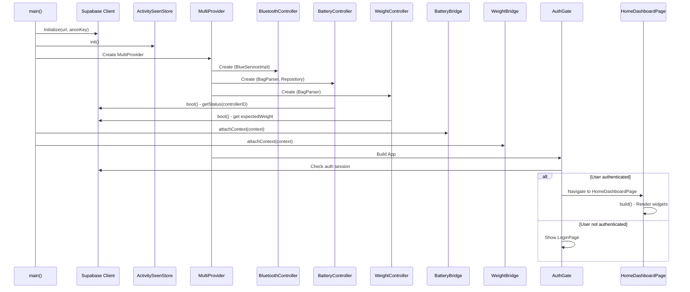
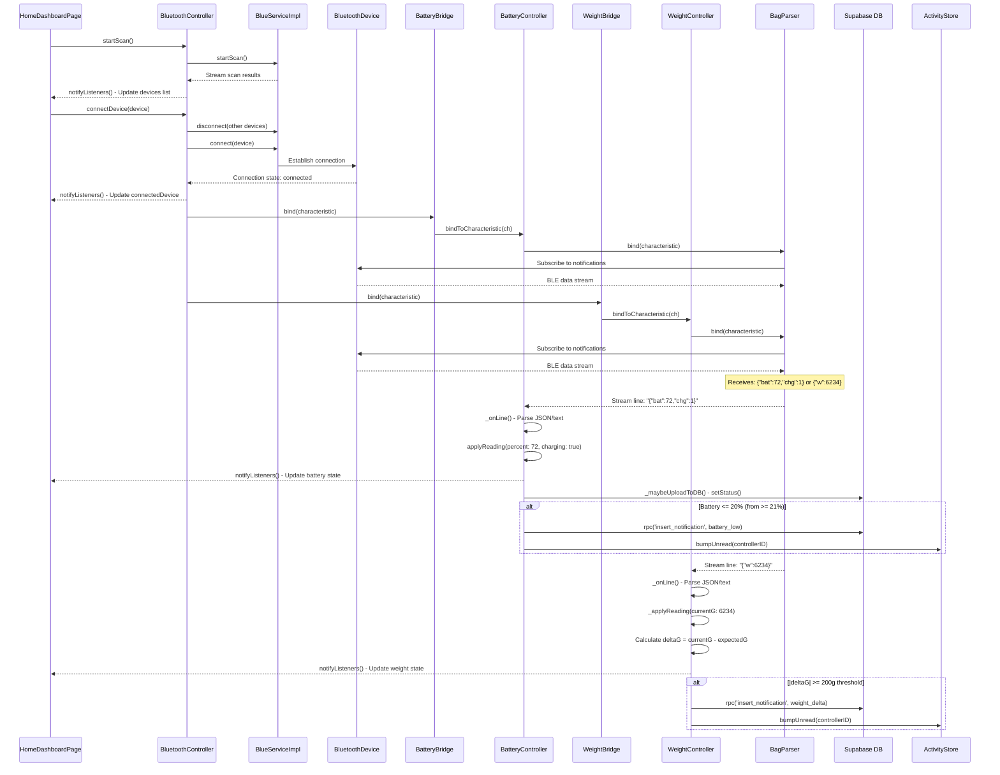
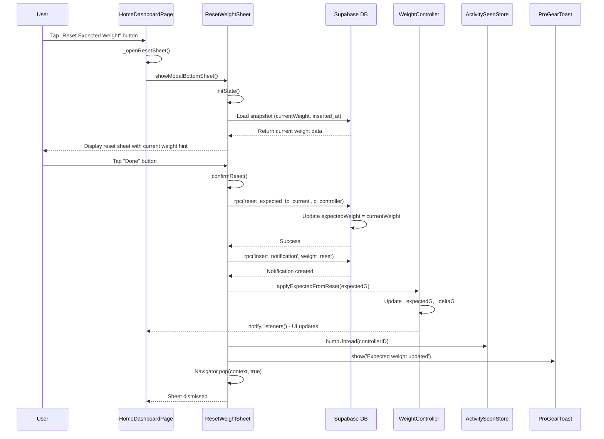
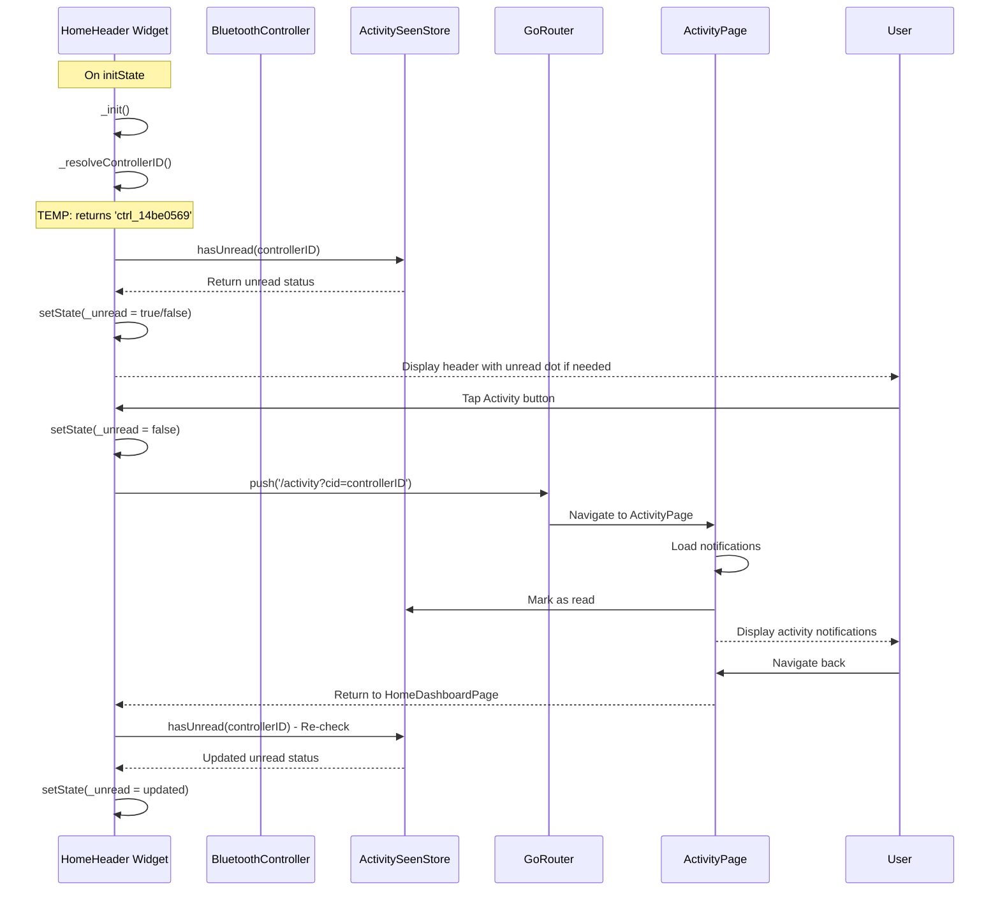
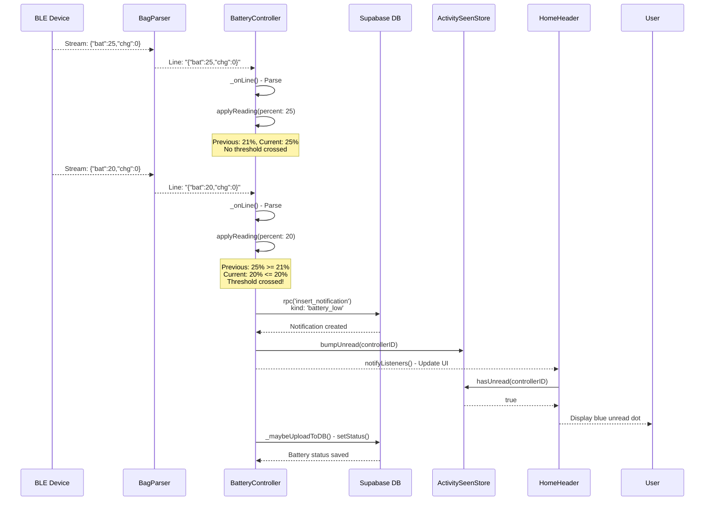
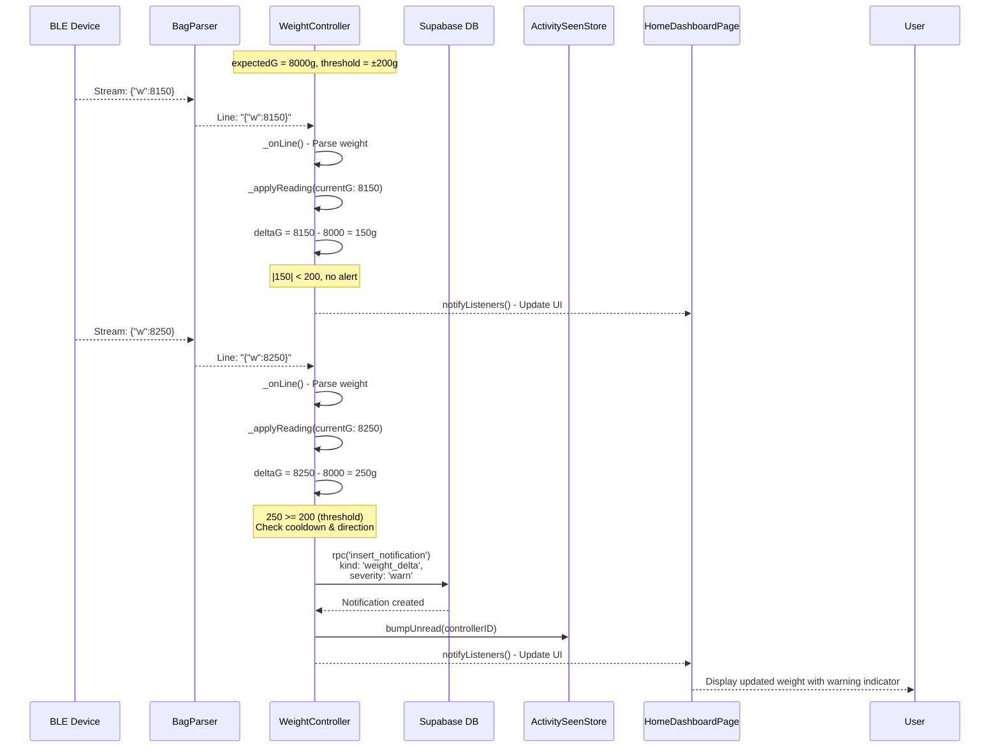

# ProGear Smart Bag - Sequence Diagrams

## 1. App Initialization and Home Dashboard Flow

## 2. Bluetooth Connection and Data Streaming Flow

## 3. Reset Expected Weight Flow

## 4. Home Header Activity Navigation Flow

## 5. Battery Low Notification Flow

## 6. Weight Delta Alert Flow

